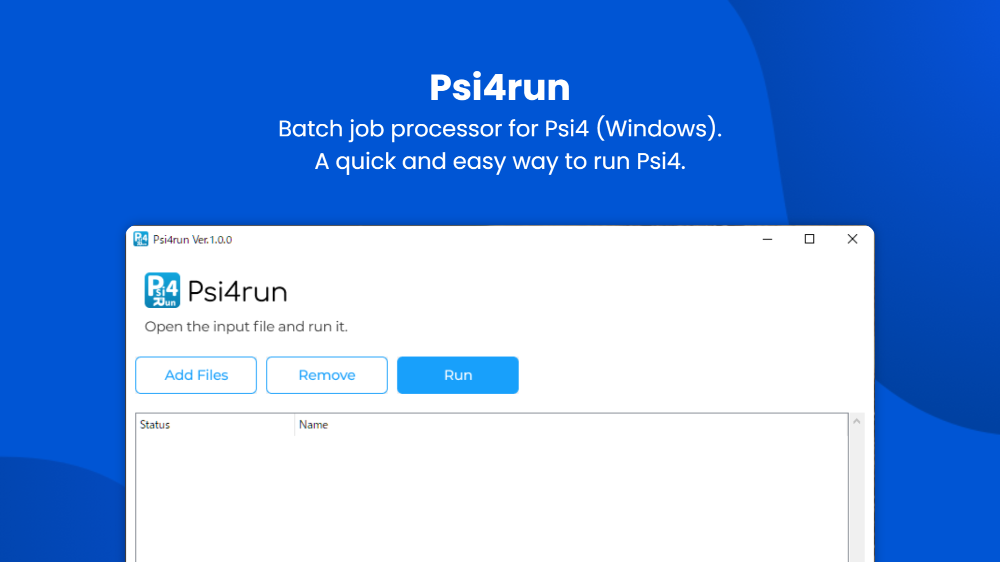

# Psi4run
Batch job processor for [Psi4](https://psicode.org/) (Windows).  
For more details on Psi4run, please go to [http://pc-chem-basics.blog.jp/archives/28253902.html](http://pc-chem-basics.blog.jp/archives/28253902.html)  

Windons executable can be downloaded on the following link:  
[**Psi4run.zip**](https://github.com/RyokoKuga/Psi4run/releases/download/v1.0.0/Psi4run.zip)  

If you prefer a drag and drop input files processor, check out Psi4DnDrun.    
[**Psi4DnDrun.zip**](https://github.com/RyokoKuga/Psi4run/releases/download/dnd.v1.0.0/Psi4DnDrun.zip)  
